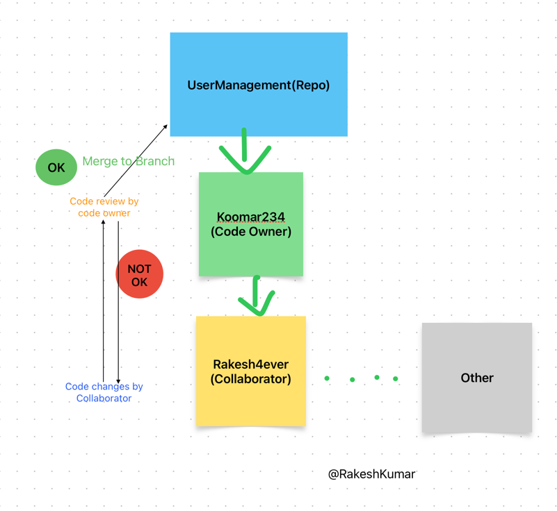

# UserManagement
User Management : CRUD Operation 

## Load and performance Testing report : Using Hey tool

To install Hey tool its straight forward using Homebrew command for Mac like : [brew install hey] also find it from https://formulae.brew.sh/formula/hey.
Other reference for other OS  https://github.com/rakyll/hey?tab=readme-ov-file.

### Steps to generate Load testing report from Hey tool

1> Suppose you want to genarate the report for an specific API e.g. http://localhost:9002/api/user/getusers

### Command would be :  hey -n 100000 -c 100000 http://localhost:9002/api/user/getusers

-n : Number of Request
-c : Concurrency 

In the above command, we are giving One lac request at once. Means We are testing the app that if we passing 100000 request at a time then how much time app will take to process it.
### Report is attached here:

