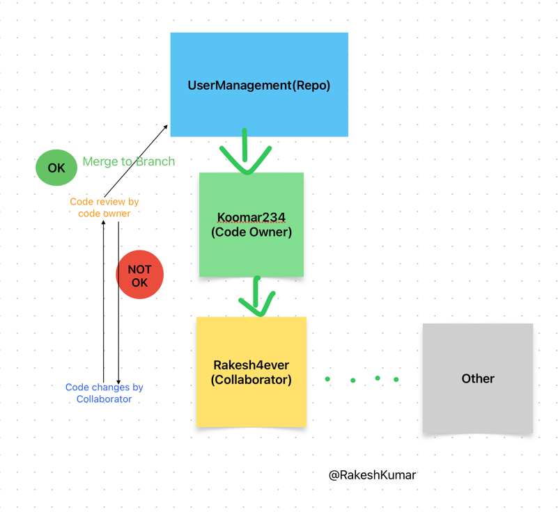
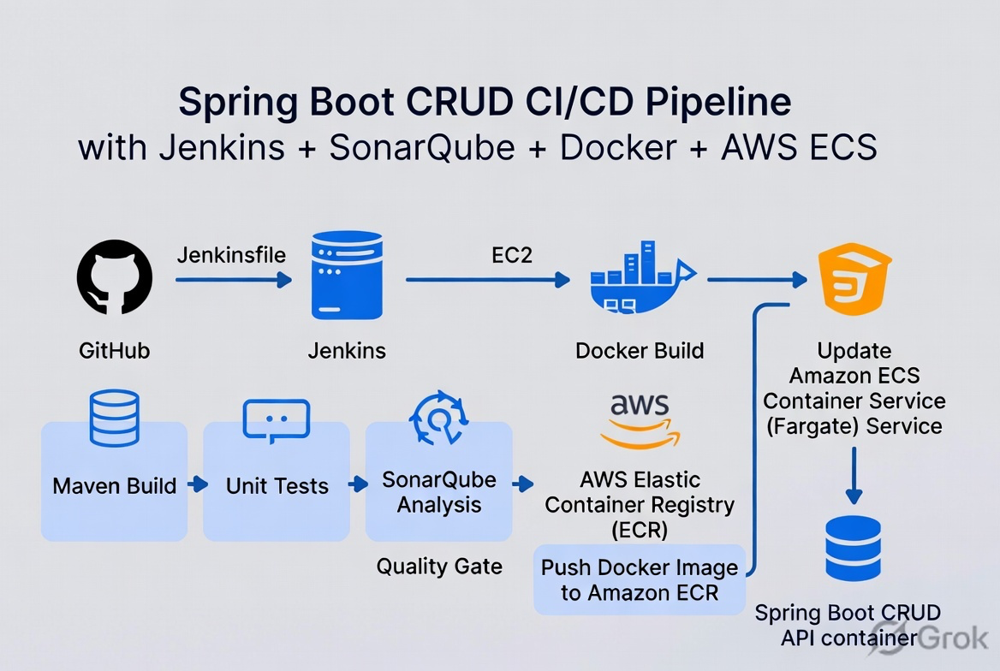

# User Management API - Complete System Guide


### System Architecture Diagram:
```
┌─────────────────────────────────────────────────────┐
│                   Client Application                 │
│              (Web/Mobile/REST Client)                │
└──────────────────────┬──────────────────────────────┘
                       │ HTTP/REST
┌──────────────────────▼──────────────────────────────┐
│          Spring Boot Application (Port: 9002)       │
├──────────────────────────────────────────────────────┤
│ ┌─────────────────────────────────────────────────┐ │
│ │         Spring Security Filter Chain             │ │
│ │  • CORS Filter  • JWT Authentication Filter      │ │
│ │  • Standard Security Filters                      │ │
│ └─────────────────────────────────────────────────┘ │
│                       ▼                              │
│ ┌─────────────────────────────────────────────────┐ │
│ │        REST Controllers                          │ │
│ │  • AuthController  • UserController              │ │
│ └─────────────────────────────────────────────────┘ │
│                       ▼                              │
│ ┌─────────────────────────────────────────────────┐ │
│ │        Service Layer                             │ │
│ │  • UserService  • JwtTokenProvider               │ │
│ │  • CustomUserDetailsService                      │ │
│ └─────────────────────────────────────────────────┘ │
│                       ▼                              │
│ ┌─────────────────────────────────────────────────┐ │
│ │        Repository Layer (JPA)                    │ │
│ │  • UserRepository                                │ │
│ └─────────────────────────────────────────────────┘ │
│                       ▼                              │
│ ┌─────────────────────────────────────────────────┐ │
│ │        Entity Layer                              │ │
│ │  • User Entity (JPA Mapped)                      │ │
│ └─────────────────────────────────────────────────┘ │
└──────────────────────┬──────────────────────────────┘
                       │ JDBC
┌──────────────────────▼──────────────────────────────┐
│              MySQL Database (localhost:3306)        │
│                   Database: test                     │
│                   Table: users                       │
└──────────────────────────────────────────────────────┘
```

### Request Flow:
```
1. User Registration → UserController → UserService → UserRepository → MySQL
2. User Login → AuthController → JwtTokenProvider → JWT Token Generated
3. API Request with JWT → JwtAuthenticationFilter → Validate Token → SecurityContext
4. Execute Endpoint → Business Logic → Database Query → Response
```

**A Spring Boot REST API for secure user management with JWT authentication and MySQL database integration.**

---

##  Quick Start (30 seconds)

```bash
# 1. Build the application
mvn clean package -DskipTests -q

# 2. Start the application
java -jar target/UserManagement-0.0.1-SNAPSHOT.jar

# 3. Register a user
curl -X POST http://localhost:9002/api/user/register \
  -H "Content-Type: application/json" \
  -d '{"name":"John","email":"john@example.com","password":"pass123","address":"123 St"}'

# 4. Login
curl -X POST http://localhost:9002/api/auth/login \
  -H "Content-Type: application/json" \
  -d '{"username":"john@example.com","password":"pass123"}'

# 5. Use token to call protected API
curl -X GET http://localhost:9002/api/user/getusers \
  -H "Authorization: Bearer YOUR_JWT_TOKEN"
```

---

##  Complete Documentation Index

### For Complete Detailed Documentation:
 **[See COMPREHENSIVE_README.md](./COMPREHENSIVE_README.md)** for:
- ✅ Full project architecture
- ✅ Prerequisites and setup
- ✅ Database configuration
- ✅ All API endpoints with examples
- ✅ Step-by-step testing guide
- ✅ JWT authentication flow
- ✅ Security features
- ✅ Troubleshooting guide
- ✅ Production deployment checklist

---

##  Project Overview

**User Management API** is an enterprise-grade REST API built with:
- **Framework**: Spring Boot 3.3.x
- **Security**: Spring Security + JWT (JJWT)
- **Database**: MySQL 8.0
- **ORM**: Hibernate/JPA
- **Build**: Maven

###  Key Features:
- ✅ Secure user registration and login
- ✅ JWT token-based authentication
- ✅ Complete CRUD operations for users
- ✅ BCrypt password encoding
- ✅ MySQL database persistence
- ✅ CORS support for cross-origin requests
- ✅ Global exception handling
- ✅ Role-based access control

### System Architecture:



---

## Authentication Flow

1. **Register**: User creates account with email and password
2. **Login**: User authenticates with email/password, receives JWT token
3. **Authorize**: User includes JWT token in Authorization header
4. **Execute**: Server validates token and executes the request
5. **Response**: Server returns user data or error

---

##  Main API Endpoints

| Method | Endpoint | Authentication | Description |
|--------|----------|-----------------|-------------|
| POST | `/api/user/register` | ❌ No | Register new user |
| POST | `/api/auth/login` | ❌ No | Login and get JWT token |
| GET | `/api/user/getusers` | ✅ Yes | Get all users |
| GET | `/api/user/{id}` | ✅ Yes | Get user by ID |
| POST | `/api/user/save` | ✅ Yes | Create new user |
| PUT | `/api/user/update/{id}` | ✅ Yes | Update user details |
| PATCH | `/api/user/partialUpdate/{id}` | ✅ Yes | Partial user update |
| DELETE | `/api/user/delete/{id}` | ✅ Yes | Delete user |

---

##  Getting Started

### Prerequisites:
```bash
✅ Java 21+
✅ Maven 3.9+
✅ MySQL 8.0+
```

### Installation:
```bash
cd /Users/rkumar/workspace/UserManagement
mvn clean package -DskipTests -q
```

### Start the Server:
```bash
java -jar target/UserManagement-0.0.1-SNAPSHOT.jar
```

### Verify it's Running:
```bash
curl -s http://localhost:9002/actuator/health
# Response: {"status":"UP"}
```

---

## Basic Usage Examples

### 1. Register User
```bash
curl -X POST http://localhost:9002/api/user/register \
  -H "Content-Type: application/json" \
  -d '{
    "name": "Alice Johnson",
    "email": "alice@example.com",
    "password": "alice123",
    "address": "123 Main St"
  }'
```

### 2. Login (Get JWT Token)
```bash
curl -X POST http://localhost:9002/api/auth/login \
  -H "Content-Type: application/json" \
  -d '{
    "username": "alice@example.com",
    "password": "alice123"
  }'

# Response includes: token, tokenType, username, expiresIn
```

### 3. Get All Users (Protected - Needs JWT)
```bash
TOKEN="your_jwt_token_here"

curl -X GET http://localhost:9002/api/user/getusers \
  -H "Authorization: Bearer $TOKEN"
```

### 4. Create User (Protected - Needs JWT)
```bash
TOKEN="your_jwt_token_here"

curl -X POST http://localhost:9002/api/user/save \
  -H "Content-Type: application/json" \
  -H "Authorization: Bearer $TOKEN" \
  -d '{
    "name": "Bob Smith",
    "email": "bob@example.com",
    "password": "bob456",
    "address": "456 Oak Ave"
  }'
```

### 5. Update User (Protected - Needs JWT)
```bash
TOKEN="your_jwt_token_here"

curl -X PUT http://localhost:9002/api/user/update/1 \
  -H "Content-Type: application/json" \
  -H "Authorization: Bearer $TOKEN" \
  -d '{
    "name": "Alice Updated",
    "email": "alice.updated@example.com",
    "password": "newpass123",
    "address": "789 Pine Lane"
  }'
```

### 6. Delete User (Protected - Needs JWT)
```bash
TOKEN="your_jwt_token_here"

curl -X DELETE http://localhost:9002/api/user/delete/1 \
  -H "Authorization: Bearer $TOKEN"
```

---

##  Automated Testing

Create a test script: `test_api.sh`

```bash
#!/bin/bash

# Get token
TOKEN=$(curl -s -X POST http://localhost:9002/api/auth/login \
  -H "Content-Type: application/json" \
  -d '{"username":"testuser@example.com","password":"password"}' | jq -r '.token')

echo "Token: $TOKEN"

# Test all endpoints
curl -s -X GET http://localhost:9002/api/user/getusers \
  -H "Authorization: Bearer $TOKEN" | jq
```

Run: `chmod +x test_api.sh && ./test_api.sh`

---

##  Security

### Password Encryption:
- ✅ BCrypt encoding with strength 10
- ✅ Salted hashes
- ✅ Never stored in plain text

### JWT Token:
- ✅ HMAC-SHA512 signature
- ✅ 24-hour expiration
- ✅ Stateless authentication
- ✅ Validated on every request

### API Security:
- ✅ CSRF protection enabled
- ✅ SQL injection prevention
- ✅ CORS configured
- ✅ Exception handling

---

## Performance Testing Report: Using Hey Tool

To install Hey tool its straight forward using Homebrew command for Mac like : [brew install hey] also find it from https://formulae.brew.sh/formula/hey.
Other reference for other OS  https://github.com/rakyll/hey?tab=readme-ov-file.

### Steps to generate Load testing report from Hey tool

1> Suppose you want to genarate the report for an specific API e.g. http://localhost:9002/api/user/getusers

### Command would be :  hey -n 100000 -c 100000 http://localhost:9002/api/user/getusers

-n : Number of Request
-c : Concurrency 

In the above command, we are giving One lac request at once. Means We are testing the app that if we passing 100000 request at a time then how much time app will take to process it.
### Report is attached here:


### Production deployment steps with AWS ECR



Pipeline Explanation (with the diagram above):
Flow Summary:

GitHub → Triggers Jenkins pipeline
Jenkins performs: Build → Test → SonarQube Code Quality Check
If Quality Gate passes → Builds Docker image
Pushes image to Amazon ECR
Deploys updated image to Amazon ECS (Fargate)
